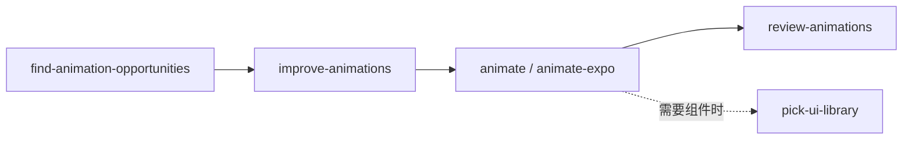

# Emil 设计技能集 · 中文导读

本仓库是 [Emil Kowalski 设计技能集](https://github.com/emilkowalski/skills)的个人镜像。收录 14 个技能，帮助设计师与工程师把界面、动画和移动端体验做得更好。技能内容保持上游原样（仅 `prototype` 因与其他技能集重名，改名为 `emil-prototype`）；下半部分是上游 README 的中文译文，英文原文见 [README.en.md](./README.en.md)。

## 安装

```bash
npx skills@latest add toRolex/emil-design-skills
```

## 什么时候用什么技能

**以下分组与推荐顺序是本镜像的归纳，不是上游规定的统一流程。** 不必把所有技能串起来；根据当前问题选用即可。

先分清两种调用方式（由技能自带的 frontmatter 元数据决定，装到遵守该元数据的 Agent 才生效）：

- **可被模型自动调用**（11 个）：技能描述里写了触发条件，任务匹配时允许模型自行调用，但不保证一定触发。
- **需要显式调用**（3 个）：上游设置了 `disable-model-invocation: true`，在遵守该元数据的 Agent 中模型不会自动触发，要用时主动点名；具体入口以所用工具为准。

### 动画

| 技能 | 调用方式 | 什么时候用 |
| --- | --- | --- |
| `animate` | 模型自动 | 从零构建 Web 动画时：该不该动、选曲线/时长/属性、处理中断与退出，直接产出实现 |
| `animate-expo` | 模型自动 | 同样的标准用在 React Native / Expo：手势、面板、触感反馈，且动画不占 JS 线程 |
| `find-animation-opportunities` | 模型自动 | 不知道哪里值得加动效时：找出该动的位置，同时明确列出不该动的拒绝清单 |
| `improve-animations` | 模型自动 | 已有动画质量参差时：审计全代码库，产出按优先级排列、任何 Agent 都能执行的实施计划 |
| `review-animations` | **显式** | 动画做完要验收时：按十条不可协商标准评审 diff，给出 Block / Approve 结论 |
| `animation-vocabulary` | 模型自动 | 说不清想要什么效果时：把「弹一下的那种」翻译成精确的动画术语，再交给其他动画技能 |

### 界面与设计

| 技能 | 调用方式 | 什么时候用 |
| --- | --- | --- |
| `emil-design-eng` | 模型自动 | 核心技能：日常 UI 打磨、组件设计、动画决策哲学；评审界面时的默认入口 |
| `apple-design` | 模型自动 | 想要 Apple 质感时：把 WWDC 设计演讲（spring、直接操纵、材质）的原则用到 Web 上 |
| `emil-prototype` | **显式** | 方案拿不定时：把一段 UI 描述做成多个真正不同的变体，用切换器现场比较选型 |
| `pick-ui-library` | **显式** | 要选 UI 依赖时：从作者信赖的库清单（base-ui、cmdk、Sonner 等）里选，不让 AI 手写组件 |
| `break-ui` | 模型自动 | 上线前压测时：用最坏情况的真实数据（超长姓名、空列表、非拉丁文字）喂 UI，报告哪里坏 |
| `mobile-native` | 模型自动 | Web 应用在手机上「感觉不对」时：修复 sticky hover、100vh、输入缩放、安全区等平台层细节 |

### 专项工具

| 技能 | 调用方式 | 什么时候用 |
| --- | --- | --- |
| `ask-sonner` | 模型自动 | 用到 Sonner（作者的 toast 库）时：接入、选调用方式、样式阶梯与排障 |
| `write-swift` | 模型自动 | 写或评审 Swift 时：值类型、Swift 6 并发、泛型、性能与 Swift Testing |

### 调用顺序



其余技能均可独立使用，按当前问题选用即可。

---

# 上游 README · 中文译文

以下内容译自 Emil Kowalski 的上游 README；保留原结构与链接。文中“我”指原作者 **Emil Kowalski**，并非镜像维护者。

<a href="http://aiforui.dev/">

</a>

# 面向设计师与工程师的技能

[](https://skills.sh/emilkowalski/skills)

帮助设计师与工程师构建更好的用户界面。

无论是动画还是一般设计，要判断自己是否做出了正确选择，都不容易。这些技能旨在帮助你更快地做出正确决策。

它们来自我在 Vercel、Linear 等公司多年的工作经验。

这里所有技能都是领域专长积累的产物。AI 不会取代这样的专长，而是放大它的价值，让你相比他人做得更好。

所以，去学习编程、设计，或培养任何其他领域的专长。这非常有价值。

你可以在这里关注我的技能更新：

[订阅通讯](https://aiforui.dev/skills)

## 安装

```bash
npx skills@latest add emilkowalski/skills
```

## 为什么使用它？

Agent 的品味并不出色。

我见过很多次，Agent 没有为动画选对要素：本该用 `ease-out` 的入场动画，却用了 `ease-in`（[原因在这里](https://emilkowal.ski/ui/7-practical-animation-tips#4.-choose-the-right-easing)）；或者给界面选择了实色边框，而不是半透明阴影。

这些小细节叠加起来，会让你的界面非常出色，或者……没那么好。

正如 [Agents with Taste](https://emilkowal.ski/ui/agents-with-taste) 中所解释的，这些技能列出 Agent 可能犯的细小错误，并说明如何修正。

这是通往优秀界面的捷径，也是从大量粗劣作品中脱颖而出的捷径。

## 参考

- **[emil-design-eng](./skills/emil-design-eng/SKILL.md)** — 核心技能，主要包含动画建议，也有一些设计建议。
- **[animate](./skills/animate/SKILL.md)** — 从零构建动画，选择正确的曲线、时长、属性等。
- **[animate-expo](./skills/animate-expo/SKILL.md)** — 将同样的标准用于 React Native 和 Expo：手势、面板、触觉反馈、页面转场，以及让动画不占用 JS 线程。
- **[review-animations](./skills/review-animations/SKILL.md)** — 按照我的规则严格审查你的动画。
- **[improve-animations](./skills/improve-animations/SKILL.md)** — 审计代码库中的所有动画，生成按优先级排列、完整独立且任何 Agent 都能执行的计划。
- **[find-animation-opportunities](./skills/find-animation-opportunities/SKILL.md)** — 在 UI 中寻找真正能从动效受益的位置，同时告诉你哪些地方不该加动画。
- **[animation-vocabulary](./skills/animation-vocabulary/SKILL.md)** — 使用准确的词汇，向 AI 明确表达你的需求，从而获得更好的动画。
- **[apple-design](./skills/apple-design/SKILL.md)** — 从 Apple 的 WWDC 设计演讲中提炼界面设计与流畅动效原则，并转化为适用于 Web 的指导。
- **[write-swift](./skills/write-swift/SKILL.md)** — 编写现代 Swift，涵盖值类型、Swift 6 并发、泛型、性能和 Swift Testing。
- **[pick-ui-library](./skills/pick-ui-library/SKILL.md)** — 让 Agent 根据我使用并信赖的库为任务选择合适的依赖，而不是让 AI 手写 toast 组件或安装无人维护的包。
- **[emil-prototype](./skills/emil-prototype/SKILL.md)** — 为你描述的 UI 部分构建多个不同版本，并通过切换器逐一比较。
- **[mobile-native](./skills/mobile-native/SKILL.md)** — 让 Web 应用在手机上拥有原生感：修复悬停状态残留、点击高亮闪烁、100vh 问题、输入框导致页面缩放、点击延迟、安全区，以及其他区分网站与应用的小细节。
- **[break-ui](./skills/break-ui/SKILL.md)** — 用最糟糕的数据尝试破坏你构建的 UI：长姓名、特殊邮箱、单字姓名、巨大计数、空列表、长标签。
- **[ask-sonner](./skills/ask-sonner/SKILL.md)** — 使用我的 toast 库 [Sonner](https://sonner.emilkowal.ski) 的指南，包含设置、样式、常见用法，以及最常见问题的修复方法。
